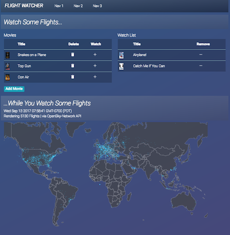

Angular 4 Flight Watcher
=====================

This is a very simple, quick-and-dirty full-stack app I built over a few days to learn the basics of Angular 4 and D3. (please disregard some of the styling)

It includes a movie selection/watch list. Movies can be added/deleted to/from the database, and from there added/removed to/from a "watch" list. Very simple.

It also includes a map rendered with D3 showing the latitude/longitude location of several thousand current flights around the world, sourced from the OpenSky Network's API.

Sept. 12, 2017



## Installation

The repository can be downloaded and run as a web application locally.

1. Run npm install to download necessary dependencies.
2. In the terminal, build the distribution files and start the Node server:
```
$ ng build
$ npm run start
```

## Technology
Front:
Angular 4, HTML5/CSS3, Typescript, D3

Server and Database:
Node.js, Express, PostgreSQL, Knex.js

Services:
Heroku, OpenSky Network API

## Developed By | September 2017:

John Seymour: https://github.com/andromeda111
Email: jmseymour111@gmail.com
